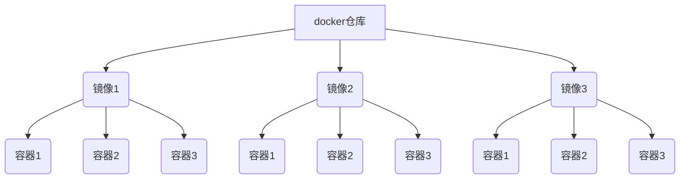

[toc]

# docker简介

docker核心知识点，docker仓库类似npm仓库，存放各种依赖包，镜像类似于vue-cli脚手架，通过脚手架也就是镜像可以创建N多个vue项目也就是容器，docker仓库、镜像和容器关系如下图





# Dockerfile

```dockerfile
FROM node
ADD . /app/
EXPOSE 3000
WORKDIR /app
RUN npm install
CMD ['node', './index.js']
```

+ `FROM` 设置基础镜像，这里使用node

+ `ADD` 是将当前文件夹下的哪些文件添加到镜像中 参数是`[source, target]`

+ `ENV` 设置环境变量

  - `<key> <value>` `NODE_VERSION 7.2.0`
  - `<key1>=<value1> <key2>=<value2>` `NODE_VERSION=7.2.0`

+ `VOLUME` 定义匿名卷 容器运行时应该尽量保持容器存储层不发生写操作，对于数据库类需要保存动态数据的应用，其数据库文件应该保存于卷(volume)中 

  - `VOLUME /data`
  - `docker run -d -v mydata:/data xxxx`

+ `USER` 指定当前用户

+ `ONBUILD` 是一个特殊的指令，它后面跟的是其它指令，比如 `RUN`, `COPY` 等，而这些指令，在当前镜像构建时并不会被执行。只有当以当前镜像为基础镜像，去构建下一级镜像的时候才会被执行

  - ```dockerfile
    FROM node:slim
    RUN mkdir /app
    WORKDIR /app
    ONBUILD COPY ./package.json /app
    ONBUILD RUN [ "npm", "install" ]
    ONBUILD COPY . /app/
    CMD [ "npm", "start" ]
    ```

+ `HEALTHCHECK` 健康检查

+ `COPY` 是将当前文件夹下的哪些文件复制到指定位置 参数是`[source, target]`

+ `EXPOSE` 向外暴露的端口号

+ `WORKDIR` 工作目录，这里将文件添加到的是app目录所以配置app目录为工作目录，这样就不用在命令行前面加`/app`

+ `RUN` 要执行的脚本命令

+ `CMD` 执行的`cmd`命令

# docker操作命令

- `docker` 查看docker帮助
- `docker images` 查看镜像列表
- `docker ps -a` 列出所有镜像
- `docker container ls` 查看正在运行中的镜像
- `docker container ls -a` 查看所有镜像(包含未运行)
- `docker pull [选项] [Docker Registry 地址[:端口号]/]仓库名[:标签]` 从 Docker 镜像仓库获取镜像
- `docker build -t vuenginxcontainer .`  
  - `-t` 是给镜像命名
  -  `.` 是基于当前目录的Dockerfile来构建镜像
- [docker create](https://docs.docker.com/engine/reference/commandline/create/#options) 命令通过镜像去创建一个容器，同时吐出容器 id。

  - `docker create --name ubuntuContainer ubuntu:18.04`
- 用 [docker start](https://docs.docker.com/engine/reference/commandline/start/) 即可运行改容器

  - `docker start ubuntuContainer`
- 用 [docker ps](https://docs.docker.com/engine/reference/commandline/ps/#usage) 即可查看运行中的 container
- 用 [docker exec](https://docs.docker.com/engine/reference/commandline/exec/) 即可进入该 container。

  - `docker exec -it 9292 bash` 
  - 只用 `-i` 参数时，由于没有分配伪终端，界面没有我们熟悉的 Linux 命令提示符，但命令执行结果仍然可以返回。
  - 当 `-i` `-t` 参数一起使用时，则可以看到我们熟悉的 Linux 命令提示符。
- 用 [docker run](https://docs.docker.com/engine/reference/commandline/run/) 可以一步到位创建并运行一个容器，然后进入该容器

  - `docker run -it -v /test:/soft -p 3000:80 -d --name vueApp --rm vuenginxcontainer bash` 以这个镜像为基础启动并运行一个容器
    - `-it`：这是两个参数，一个是 `-i`：交互式操作，一个是 `-t` 终端。我们这里打算进入 `bash` 执行一些命令并查看返回结果，因此我们需要交互式终端
    - `-v` 挂载宿主机的一个目录，可以用-v参数指定 ` -v /test:/soft` 宿主机的/test目录挂载到容器的/soft目录
    - `-e` 为容器设置环境变量
    - `-d` 后台方式运行
    - `--name` 容器名 查看 docker 进程
    - `-p 3000:80` 端口映射，将宿主的3000端口映射到容器的80端口
    - `--rm`：这个参数是说容器退出后随之将其删除。默认情况下，为了排障需求，退出的容器并不会立即删除，除非手动 `docker rm`。我们这里只是随便执行个命令，看看结果，不需要排障和保留结果，因此使用 `--rm` 可以避免浪费空间
    - `vuenginxcontainer`：这是指用 `ubuntu:18.04` 镜像为基础来启动容器
    - `bash` 放在镜像名后的是 **命令**，这里我们希望有个交互式 Shell，因此用的是 `bash`

- `docker image rm <镜像名 | 镜像id>` 删除本地镜像
- `docker container rm <容器名 | 容器id>` 删除本地容器

  - `-f` 参数。Docker 会发送 `SIGKILL` 信号给容器，删除进行中的容器
- `docker container prune` 清理掉所有处于终止状态的容器

# 制作镜像

## 以容器为基础

1. 选中某一镜像作为基础镜像

2. 以该基础镜像制作一个容器，进行修改后进行commit提交，会在本地显示制作的镜像

   - `docker commit -a "wangshibo" -m "this is test" 651a8541a47d myubuntu:v1`

   - `docker commit [OPTIONS] CONTAINER [REPOSITORY[:TAG]]`
     - `-a`  提交的镜像作者
     - `-c`  使用Dockerfile指令来创建镜像
     - `-m` 提交时的说明文字
     - `-p` 在commit时，将容器暂停

3. 把制作的镜像推送到dockerhub仓库中去

   - `docker push wangshibo/myubuntu:v1 `   

   - `docker push [OPTIONS] NAME[:TAG]`
     - `OPTIONS` 说明

## 以Dockerfile为基础

1. 在项目内，添加对应的 `Dockerfile `文件，以及`.dockerignore` 等
2. `docker build -t [基础镜像] .`

# 容器通信

## 通过数据卷挂载主机目录

```dockerfile
docker run -d -P \
    --name web \
    # -v /src/webapp:/usr/share/nginx/html \
    --mount type=bind,source=/src/webapp,target=/usr/share/nginx/html,readonly \
    nginx:alpine
```

+ 使用 `-v` 参数时如果本地目录不存在 Docker 会自动为你创建一个文件夹，使用 `--mount` 参数时如果本地目录不存在，Docker 会报错
  + -v 和 --mount 后面参数 (宿主机:容器)
+ 加了 `readonly` 之后，就挂载为 `只读` 了。如果你在容器内 `/usr/share/nginx/html` 目录新建文件,会报错

## 通过bridge

1. 创建新网络

   + `docker network create -d bridge <network-name>`
     + `-d` 参数指定 Docker 网络类型，有 `bridge` `overlay`。其中 `overlay` 网络类型用于 [Swarm mode]()

2. 将容器连接到网络

   + `docker run --name busybox1 --network <network-name> busybox`
     + 启动容器并连接网络

   + `docker network connect <network-name> <container-name>`
     + 将已启动的容器连接到网络

3. 按名称ping容器

   `docker exec -it <container-name-A> ping <container-name-B>`